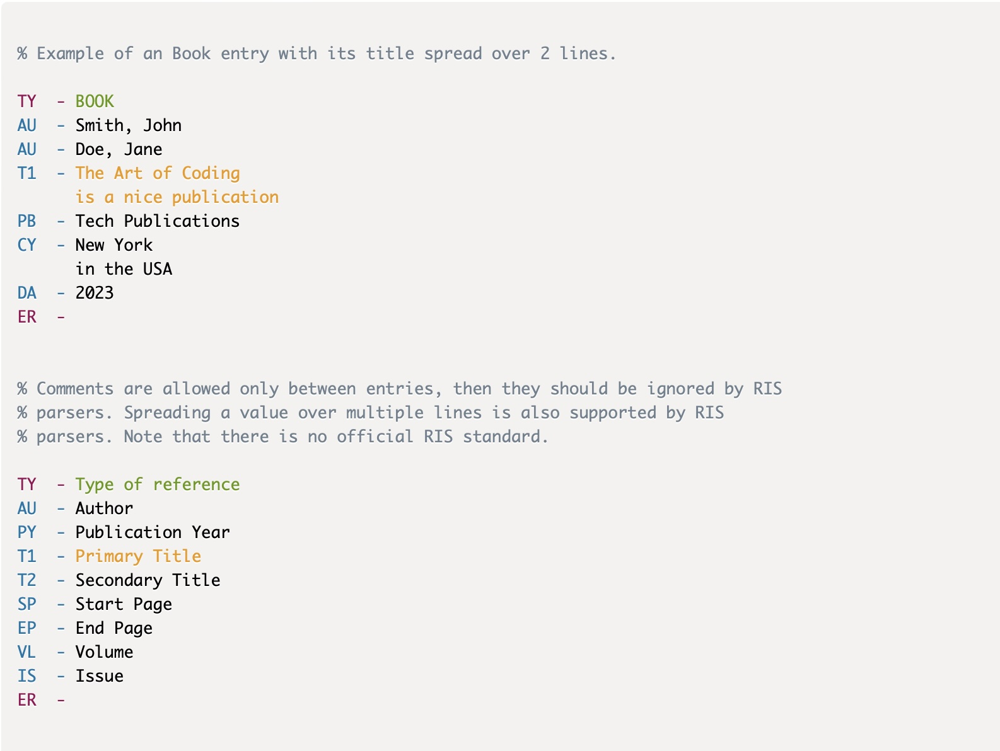

# PrismJS-RIS

[](https://www.npmjs.com/package/prismjs-ris)
[](https://www.jsdelivr.com/package/npm/prismjs-ris)

Syntax highlighting the RIS publication format.

Implemented by a language definition for RIS in the PrismJS syntax highlighting
framework.

## Example

An example of the main version of syntax highlighting of RIS source code is shown
below in the image, but a live example is shown
[here.](https://raw.githack.com/harcokuppens/prismjs-ris/main/example.html)



The start and end tags of a RIS publication are colored different then normal tags.
The type of publication in the start tag and the title of the publication are each
colored different to make them standout from normal tags. The
[example](https://raw.githack.com/harcokuppens/prismjs-ris/main/example.html) also
explains the details about comments in the RIS source which are ignored by RIS
parsers.

## Usage

### In HTML

Simply import the `prism-ris.min.js` (recommended at the end of `body`):

```html
<script src="https://cdn.jsdelivr.net/npm/prismjs-ris@1.0.2/prism-ris.min.js"></script>
```

Remember to import the PrismJS stylesheets and scripts **before** importing this
extension. For example:

```html
<link
  rel="stylesheet"
  href="https://cdnjs.cloudflare.com/ajax/libs/prism/1.29.0/themes/prism-solarizedlight.min.css"
/>
<script src="https://cdnjs.cloudflare.com/ajax/libs/prism/1.29.0/prism.min.js"></script>
<script src="https://cdn.jsdelivr.net/npm/prismjs-ris@1.0.2/prism-ris.min.js"></script>
```

### In NodeJS

1. Add the package to your project:

   ```console
   $ npm install prismjs-ris
   ```

2. Import `prismjs-ris` your .js file, after Prism:

   ```js
   import Prism from "prismjs";
   import "prismjs-ris";
   ```
